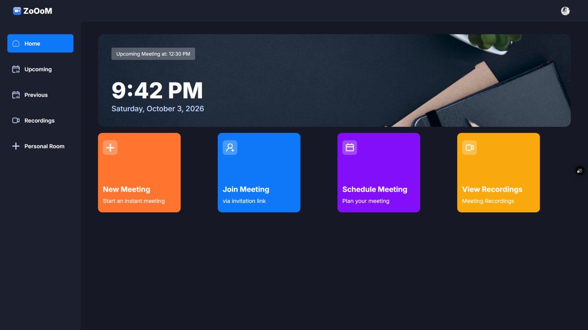
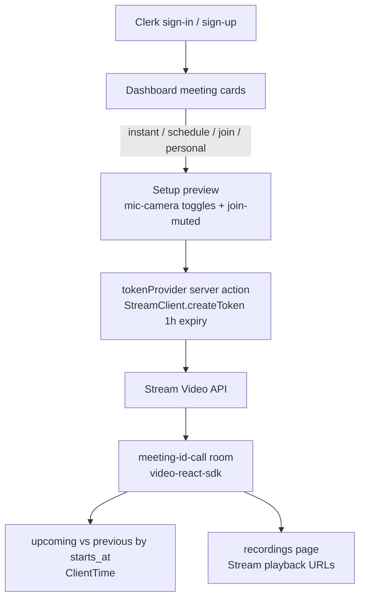
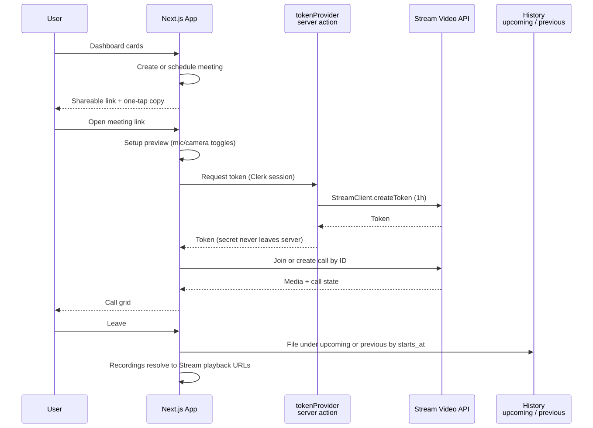

# ZoOoM — Zoom Clone

> Self-owned video conferencing: instant, scheduled, and personal-room meetings with device preview, history, and Stream-hosted recordings.

**Stack:** Next.js 14.2.3 (App Router) · React 18 · TypeScript 5 · Clerk 5 · Stream Video (`node-sdk` + `video-react-sdk`) · Tailwind 3.4 + shadcn/Radix · `react-datepicker`



| Fact | Evidence |
| --- | --- |
| Full meeting lifecycle in one codebase | `app/(root)/(home)` — home, personal-room, previous, recordings, upcoming + `meeting/[id]` |
| Stream secrets never reach the browser | `tokenProvider` server action (`action/stream.action.ts`) mints per-user tokens |
| Timezone-correct history split | `ClientTime` component + `Time*` fix sequence in `git log` |
| 21 commits from auth to recordings | History: Clerk → Stream basics → meeting-by-ID → history pages → ClientTime → engine pin |

## The Problem

Small teams, tutors, and interviewers need link-share meetings with a revisit path — but standing up even a thin Zoom alternative means solving auth, realtime media, scheduling, and recordings together. Ad-hoc calls can't wait for setup; planned sessions need shareable links; past decisions need playback.

## The Solution

A Next.js App Router app where Clerk owns identity and Stream Video owns media. Server-component pages render the dashboard and history; client islands render the call room. A server action mints short-lived Stream tokens per user, so the browser never sees the Stream secret. Meetings and recordings live in Stream — the app holds no meeting database.



## Key Features

**Instant meetings.** Create-and-join immediately; the client creates a call by ID once the server action returns a token. Why it matters: ad-hoc calls die if they require scheduling.

**Scheduled meetings.** Description + start time via `react-datepicker`, stored with `starts_at`, link shared ahead of time. Why it matters: planned sessions are an invitation workflow, not just a room.

**Join by link.** `meeting/[id]` resolves the call ID from the URL. Why it matters: guests navigate with a paste, not an account tour.

**Personal room.** A stable per-user room for recurring 1:1s. Why it matters: one permanent URL beats a new link per session.

**Device preview.** Mic/camera toggles plus join-muted before entering the grid. Why it matters: prevents hot-mic surprises — the cheapest trust feature in conferencing.

**Upcoming vs. previous.** History partitions on `starts_at` through a dedicated client-time layer. Why it matters: users think in "what's next / what happened," not in raw call lists.

**Recordings with playback.** The recordings page resolves each item to its Stream-hosted URL. Why it matters: decisions need revisiting more than meetings need repeating.

**One-tap link copy.** Generated URL written to clipboard on creation. Why it matters: distribution *is* the job after creation.

## Key Engineering Decisions

**Problem → Constraint → Decision → Tradeoff → Result**

1. **Stream secret exposure risk.** Constraint: client-side token creation would leak `STREAM_SECRET_KEY`. Decision: `tokenProvider` server action builds the token with `StreamClient` (1-hour expiry, issued 60s early for clock skew) after `currentUser()` check. Tradeoff: every join pays a server round-trip. Result: secrets stay server-side — enforced by the `NEXT_PUBLIC_*` vs. secret key split in `.env.example`.

2. **History buckets wrong across timezones.** Constraint: server-rendered timestamps diverge from client locale. Decision: dedicated `ClientTime` component rendering `starts_at` comparisons client-side, iterated across three fix commits. Tradeoff: extra client component where SSR alone would be simpler. Result: correct local upcoming/previous split — `Testing: Client Time` → `Added: ClientTime` → `Modified: Time*`.

3. **No app database.** Constraint: meeting + recording state already lives in Stream; duplicating it adds sync bugs. Decision: query Stream as the source of truth; Clerk as identity. Tradeoff: history and search are limited to what Stream exposes. Result: zero migrations, zero orphaned meeting rows.

4. **Server pages + client call islands.** Constraint: call SDKs are heavy and device-bound. Decision: dashboard/history as server components, only the meeting room as a client island. Tradeoff: two rendering mental models in one router. Result: landing pages stay light; WebRTC JS loads where it's used.

## Iteration Story

The 21-commit history reads as a deliberate layering (oldest → newest):

`create-next-app` → Shadcn + colors + public assets → sidebar/nav/skeletons → Clerk auth → home cards → Stream basics → meeting-by-ID → video-call settings → metadata → upcoming/recording/previous → personal room → home timestamps → `Time*` fixes → ClientTime → Node 24 engine pin → README overview.

Scheduling and history arrived *after* the call worked; timezone correctness arrived *after* history worked. Each layer fixed what the previous one exposed.

## User Experience

Sign in → dashboard of meeting-type cards (new, schedule, join, personal room). Creating or scheduling yields a link with one-tap copy. Joining opens the setup preview (camera/mic toggles, join-muted) before the call grid. Afterward the meeting lands in upcoming or previous; recordings surface with playable links. The personal room stays pinned as the always-ready URL.

Visually: a dark Zoom-like console (custom `dark-*` palette in `tailwind.config.ts`), Yoom iconography from `public/icons/`, avatar art and hero background. Funnel is act (cards) → prepare (setup) → meet (call) → revisit (history/recordings).

## Results & Evidence

**Verifiable:** full lifecycle routes committed; server-action token flow reviewable in `action/stream.action.ts`; ClientTime fix sequence in history; Node 24 pin in `package.json` engines.

**Honest status:** the prior README described this as work in progress with known limitations. There is no test suite, no committed workflow, and no usage metrics in the repo — run health and call quality are observed in the live deployment (linked above), not proven here.

## Technical Details

| Area | Detail |
| --- | --- |
| Framework | Next.js 14.2.3 App Router, React 18, TypeScript 5, Tailwind 3.4, shadcn/ui on Radix |
| Auth | Clerk (`middleware.ts` gating; `(auth)/sign-in`, `(auth)/sign-up` routes) |
| Video | `@stream-io/node-sdk` (server token) + `@stream-io/video-react-sdk` (client room) |
| Scheduling UI | `react-datepicker` feeding `starts_at` |
| Key files | `app/(root)/(home)/page` + personal-room/previous/recordings/upcoming, `app/(root)/meeting/[id]/page`, `action/stream.action.ts`, `components/`, `providers/`, `constants/`, `hooks/` |
| Secrets | `NEXT_PUBLIC_CLERK_PUBLISHABLE_KEY`, `CLERK_SECRET_KEY`, `NEXT_PUBLIC_CLERK_SIGN_IN_URL`, `NEXT_PUBLIC_CLERK_SIGN_UP_URL`, `NEXT_PUBLIC_STREAM_API_KEY`, `STREAM_SECRET_KEY`, `NEXT_PUBLIC_BASE_URL` |
| Storage | No app DB — meetings/recordings in Stream, identity in Clerk |
| Errors | Unauthenticated/secret-missing throws in `tokenProvider`; SDK error states on join; empty history sets handled |

## Setup

1. **Prerequisites:** Node 24 (engines pin), npm, Clerk and Stream accounts.
2. **Clone and install:**
   ```bash
   git clone https://github.com/LowkeyGud/zoom-clone.git
   cd zoom-clone
   npm install
   ```
3. **Environment:** copy `.env.example` to `.env.local` and fill the seven keys above. Set `NEXT_PUBLIC_BASE_URL` to the deployment origin so generated links resolve.
4. **External services:** create a Clerk app; create a Stream app and read its API key/secret from the Stream dashboard.
5. **Run:**
   ```bash
   npm run dev
   ```
   Open `http://localhost:3000`, sign in via Clerk, create a meeting. Production: `npm run build` then `npm start`. Camera/mic require HTTPS or localhost.
6. **Verify:** instant meeting joined from a second browser profile; a future meeting lands in upcoming; after ending, previous + recordings update.
7. **Common issues:** join fails → Stream key/secret mismatch or token action error (server logs); camera/mic blocked → HTTPS/localhost + permissions; history buckets wrong → client-time handling.

No GitHub Actions workflow is committed in this repo.

## Lessons / Takeaways

- Token provisioning is the security boundary in any third-party realtime integration — server-minting was the first load-bearing decision.
- Timezone bugs surface only after history exists; isolating time rendering in one client component contained the fix.
- Next step would be recording lifecycle UX (loading/empty/error states) and call-quality telemetry, neither of which the repo currently records.

## Links

- Repository: `https://github.com/LowkeyGud/zoom-clone`
- Live Demo: `https://zoom-clone-hazel-pi.vercel.app`

## Diagrams

Generated from the codebase with the mermaid-skill workflow (validate via Kroki → export SVG → vision self-check). Sources live in `docs/diagrams/` — edit the `.mmd`, re-render, review. SVG is the committed format.

**Meeting lifecycle** (`docs/diagrams/meeting-lifecycle.mmd` — create → preview → server-minted token → call → history):



## Screenshots

Captured from the live deployment:


